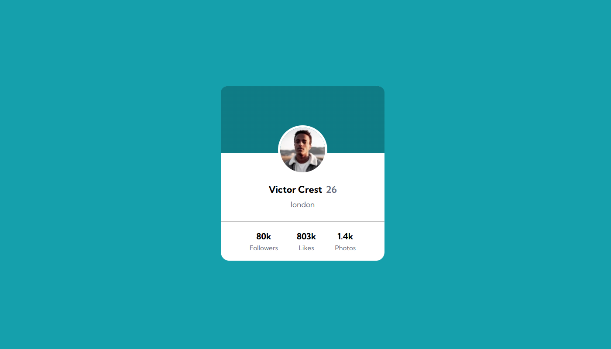

# Projeto exercicio Profile Card
Um projeto de exercicio para pratica com css e html 🚀

- Modelo proposto: 
[]

- Modelo realizado:
[]

## Tecnologias utilizadas
- HTML
- CSS

## Dificuldades 
Durante a realização desse projeto, tive um pouco de dificuldade na parte do css para criar um background de duas cores e posicionar a imagem por cima para conseguir posiciona-la em tela

Isso foi resolvido com a propriedade "background: linear-gradient" para dividir o fundo em duas cores